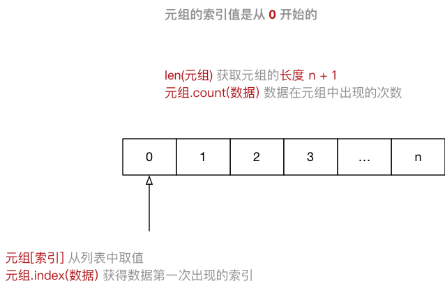

# 2.5 Python元组

## 元组的定义

- `Tuple`（元组）与列表类似，不同之处在于**元组的元素不能修改**
  - **元组** 表示多个元素组成的序列
  - **元组** 在 `Python` 开发中，有特定的应用场景
- 用于存储 **一串 信息**，**数据** 之间使用 `,` 分隔
- 元组用 `()` 定义
  - 任意无符号的对象，以逗号隔开，默认为元组。
- 元组的索引从0开始
  - **索引** 就是数据在 **元组** 中的位置编号

```
info_tuple = ("zhangsan", 18, 1.75)
```



- 元组中 只包含一个元素 时，需要 在元素后面添加逗号

```python
info_tuple = (50, )
```

- 元组中的元素如果为列表/字典，则可以修改列表字典中的元素

```python
a = [1, 2]

b = (a, 3)
print(b)

a.append(3)
print(b)
```

元组主要用于：

- 作为 函数的 参数 和 返回值**。 一个函数可以接收 **任意多个参数**，或者 **一次返回多个数据
- **格式字符串**，格式化字符串后面的 () 本质上就是一个元组
- **让列表不可以被修改**，以保护数据安全

```python
info = ("zhangsan", 18)

print("%s 的年龄是 %d" % info)
```

## 元组的常用操作

| 序号 | 分类 | 关键字 / 函数 / 方法 | 说明                                                 |
| ---- | ---- | -------------------- | ---------------------------------------------------- |
| 1    | 查询 | 元组[索引]           | 根据索引取值，索引不存在会报错                       |
|      |      | 元组.index(数据)     | 根据值查询索引，返回首次出现时的索引，没有查到会报错 |
|      |      | 元组.count(数据)     | 数据在元组中出现的次数                               |
|      |      | len(列表)            | 元组长度                                             |
|      |      | if 数据 in 元组:     | 检查元组中是否包含某元素                             |

> 由于元组不能修改，所以只有查询操作，但是可以进行连接组合。
>
> ```python
> tup1 = (12, 34.56);
> tup2 = ('abc', 'xyz')
>
> # 以下修改元组元素操作是非法的。
> # tup1[0] = 100;
>
> # 创建一个新的元组
> tup3 = tup1 + tup2
> print(tup3)
>
> # 输出结果：(12, 34.56, 'abc', 'xyz')
> ```

## 元组循环遍历

- **取值** 就是从 **元组** 中获取存储在指定位置的数据
- **遍历** 就是 **从头到尾** **依次** 从 **元组** 中获取数据

```python
# for 循环内部使用的变量 in 元组
for item in info:

    循环内部针对元组元素进行操作
    print(item)
```

> 在实际开发中，除非 **能够确认元组中的数据类型**，否则针对元组的循环遍历需求并不是很多。

## 元组与列表相互转换

- 使用 `list` 函数可以把元组转换成列表

```
list(元组)
```

- 使用 `tuple` 函数可以把列表转换成元组

```
tuple(列表)
```