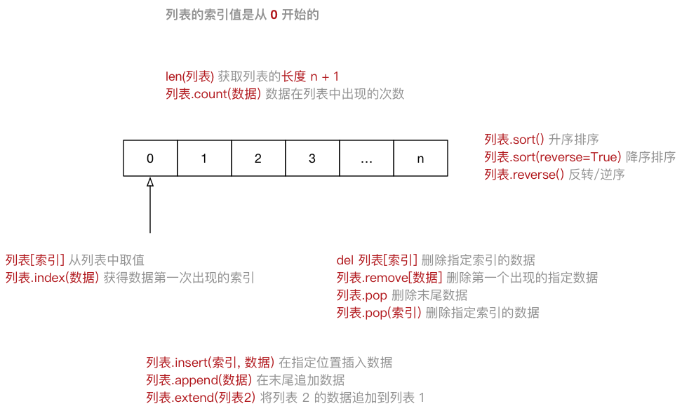
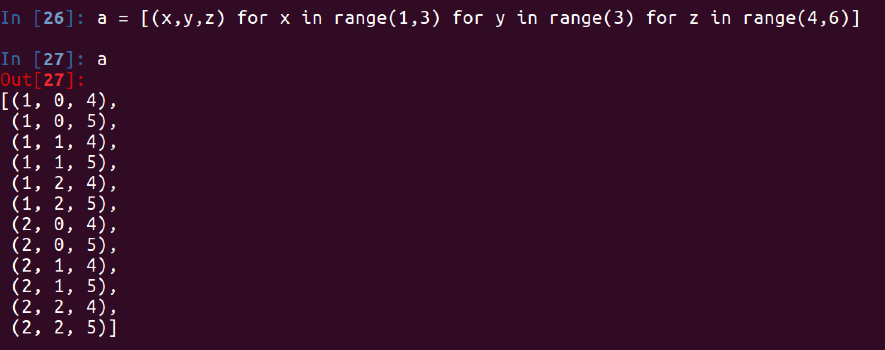

# 2.4 Python列表

## 列表的定义

- `List`（列表） 是 `Python` 中使用 **最频繁** 的数据类型，在其他语言中通常叫做 **数组**
- 专门用于存储 **一串 信息**
- 列表用 `[]` 定义，**数据** 之间使用 `,` 分隔
- 列表的索引从0开始
  - **索引** 就是数据在 **列表** 中的位置编号，**索引** 又可以被称为 **下标**

> 注意：从列表中取值时，如果 **超出索引范围**，程序会报错

```python
name_list = ["zhangsan", "lisi", "wangwu"]
```

在开发中，更多的应用场景是

1. **列表** 存储相同类型的数据
2. 通过 **for循环**，在循环体内部，针对列表中的每一项元素，执行相同的操作。

## 列表常用操作



| 序号 | 分类 | 关键字 / 函数 / 方法    | 说明                                                 |
| ---- | ---- | ----------------------- | ---------------------------------------------------- |
| 1    | 增加 | 列表.insert(索引, 数据) | 在指定位置插入数据(位置前有空元素会补位)             |
|      |      | 列表.append(数据)       | 在末尾追加数据                                       |
|      |      | 列表.extend(Iterable)   | 将可迭代对象中 的元素 追加到列表                     |
| 2    | 删除 | del 列表[索引]          | 删除指定索引的数据                                   |
|      |      | 列表.remove(数据)       | 删除第一个出现的指定数据                             |
|      |      | 列表.pop()              | 删除末尾数据,返回被删除的元素                        |
|      |      | 列表.pop(索引)          | 删除指定索引数据                                     |
|      |      | 列表.clear              | 清空列表                                             |
| 3    | 修改 | 列表[索引] = 数据       | 修改指定索引的数据，数据不存在会报错                 |
| 4    | 查询 | 列表[索引]              | 根据索引取值，索引不存在会报错                       |
|      |      | 列表.index(数据)        | 根据值查询索引，返回首次出现时的索引，没有查到会报错 |
|      |      | 列表.count(数据)        | 数据在列表中出现的次数                               |
|      |      | len(列表)               | 列表长度                                             |
|      |      | if 数据 in 列表:        | 检查列表中是否包含某元素                             |
| 5    | 排序 | 列表.sort()             | 升序排序                                             |
|      |      | 列表.sort(reverse=True) | 降序排序                                             |
|      |      | 列表.reverse()          | 逆序、反转                                           |

> 具体的操作建议读者实际操作感受，本文不再重复，接下来重点讲述表中的两个知识点。
>
> #### del 关键字

- 使用 `del` 关键字(`delete`) 同样可以删除列表中元素
- `del` 关键字本质上是用来 **将一个变量从内存中删除的**
- 如果使用 `del` 关键字将变量从内存中删除，后续的代码就不能再使用这个变量了。

```
del name_list[1]
```

> 在日常开发中，要从列表删除数据，建议 **使用列表提供的方法**

> #### 关键字、函数和方法概念区分

- **关键字** 是 Python 内置的、具有特殊意义的标识符

```python
In [1]: import keyword
In [2]: print(keyword.kwlist)
In [3]: print(len(keyword.kwlist))
```

> 关键字后面不需要使用括号

- **函数** 封装了独立功能，可以直接调用

```
函数名(参数)
```

> 函数需要死记硬背

- **方法** 和函数类似，同样是封装了独立的功能
- **方法** 需要通过 **对象** 来调用，表示针对这个 **对象** 要做的操作

```
对象.方法名(参数)
```

> 在变量后面输入 `.`，然后选择针对这个变量要执行的操作，记忆起来比函数要简单很多

## 列表循环遍历

- **遍历** 就是 **从头到尾** **依次** 从 **列表** 中取出 **每一个元素**，并执行相同的操作
- Python中实现遍历的方式很多，比如while循环、for循环、迭代器等，下一章会详细讲基本的循环语句。

```python
# while循环实现列表的遍历
i = 0
name_list = ["zhangsan", "lisi", "wangwu"]
list_count = len(name_list)
while i < list_count:
    name = name_list[i]
    print(name)
    i += 1
```

- 如上一节变量类型中提到，在 `Python` 中，可以使用 `for` 循环遍历所有非数字型类型的变量：**列表**、**元组**、**字典** 以及 **字符串**


- Python为了提高列表的遍历效率，专门提供 **for循环** 实现遍历
- Python中for循环的本质是 **迭代器**

```python
# for 实现列表的遍历
for name in name_list:

    循环内部针对列表元素进行操作
    print(name)
```

## 列表嵌套

一个列表中的元素又是一个列表，那么这就是列表的嵌套。

```
schoolNames = [['北京大学','清华大学'],
                ['南开大学','天津大学','天津师范大学'],
                ['山东大学','中国海洋大学']]
```

## 列表推导式

所谓的列表推导式，就是指的轻量级快速循环创建列表。

### 1. 基本的方式


### 2. 在循环的过程中使用if


### 3. 2个for循环


### 4. 3个for循环



