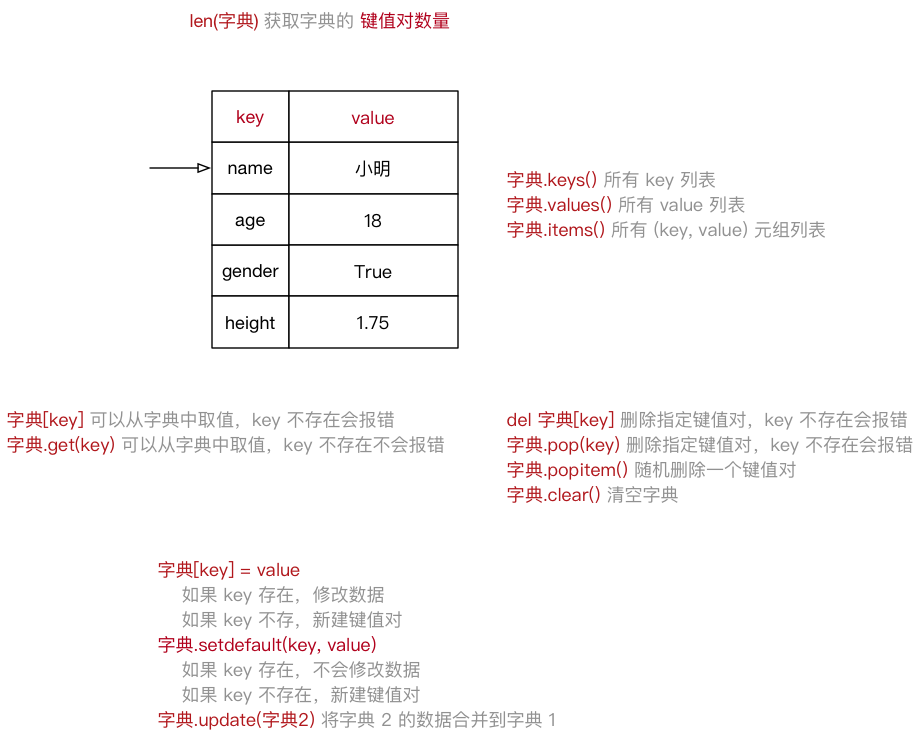

# 2.6 Python字典

## 字典的定义

- `dictionary`（字典） 是 **除列表以外** `Python` 之中 **最灵活** 的数据类型
- 字典同样可以用来存储多个数据
  - 通常用于存储 **描述一个 物体 的相关信息**
- 和列表的区别
  - **列表** 是 **有序** 的对象集合
  - **字典** 是 **无序** 的对象集合
- 字典用 `{}` 定义
- 字典使用键值对存储数据，键值对之间使用`,`分隔
  - **键** `key` 是索引
  - **值** `value` 是数据
  - **键** 和 **值** 之间使用 `:` 分隔
  - **键必须是唯一的**
  - **值** 可以取任何数据类型，但 **键** 只能使用 **字符串**、**数字**或 **元组**

```python
xiaoming = {"name": "小明",
            "age": 18,
            "gender": True,
            "height": 1.75}
```



## 字典的常用操作

正如上图那样，字典的常用操作有：

| 序号 | 分类 | 关键字 / 函数 / 方法       | 说明                                                      |
| ---- | ---- | -------------------------- | --------------------------------------------------------- |
| 1    | 增加 | 字典[键] = 数据            | 键不存在，会添加键值对；键存在，会修改键值对的值          |
| 2    | 删除 | del 字典[键]               | 删除指定的键值对                                          |
|      |      | 字典.pop(键)               | 删除指定键值对,返回被删除的值                             |
|      |      | 字典.clear()               | 清空字典                                                  |
| 3    | 修改 | 字典[键] = 数据            | 键不存在，会添加键值对；键存在，会修改键值对的值          |
|      |      | 字典.setdefault(键，数据)  | 键值对不存在，添加键值对；存在则不做处理                  |
|      |      | 字典.update(字典2)         | 取出字典2的键值对，键值对不存在，添加键值对；存在则修改值 |
| 4    | 查询 | 字典[键]                   | 根据键取值，键值对不存在会报错                            |
|      |      | 字典.get(键, default=None) | 根据键取值，键值对不存在返回default设置的值               |
|      |      | 字典.keys()                | 可进行遍历，获取所有键                                    |
|      |      | 字典.values()              | 可进行遍历，获取所有值                                    |
|      |      | 字典.items()               | 可进行遍历，获取所有(键，值)                              |
|      |      | 字典.has_key(key)          | 如果键在字典dict里返回true，否则返回false                 |

## 字典的循环遍历

```python
# for 循环内部使用的 `key 的变量` in 字典
for k in xiaoming:

    print("%s: %s" % (k, xiaoming[k]))
```

> 在实际开发中，由于字典中每一个键值对保存数据的类型是不同的，所以针对字典的循环遍历需求并不是很多。

## 字典的应用场景

- 尽管可以使用 `for in` 遍历 **字典**
- 但是在开发中，更多的应用场景是：
  - 使用 **多个键值对**，存储 **描述一个 物体 的相关信息** —— 描述更复杂的数据信息
  - 将 **多个字典** 放在 **一个列表** 中，再进行遍历，在循环体内部针对每一个字典进行 **相同的处理**

```python
card_list = [{"name": "张三",
              "qq": "12345",
              "phone": "110"},
             {"name": "李四",
              "qq": "54321",
              "phone": "10086"}
             ]
```

