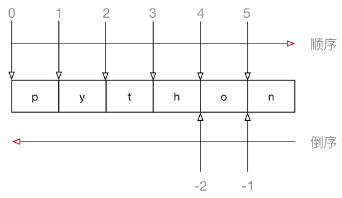

# 2.7 Python字符串

## 字符串的定义

- **字符串** 就是 **一串字符**，是编程语言中表示文本的数据类型
- 在 Python 中可以使用一对双引号`"`或者一对单引号`'`定义一个字符串
  - 虽然可以使用`\"`或者`\'`做字符串的转义，但是在实际开发中：
    - 如果字符串内部需要使用 `"`，可以使用 `'` 定义字符串
    - 如果字符串内部需要使用 `'`，可以使用 `"` 定义字符串
- 可以使用 **索引** 获取一个字符串中 **指定位置的字符**，索引计数从 **0** 开始
- 也可以使用 `for` **循环遍历** 字符串中每一个字符

> 注：大多数编程语言都是用 `"` 来定义字符串。

```python
string = "Hello Python"

for c in string:
    print(c)
```


## 字符串的常用操作

#### 1) 判断

| 方法                   | 说明                                                         |
| ---------------------- | ------------------------------------------------------------ |
| string.isalpha()       | 如果 string 至少有一个字符并且所有字符都是字母则返回 True    |
| string.isdecimal()     | 如果 string 只包含数字则返回 True                            |
| string.islower()       | 如果 string 中包含至少一个区分大小写的字符，并且所有这些(区分大小写的)字符都是小写，则返回 True |
| string.isupper()       | 如果 string 中包含至少一个区分大小写的字符，并且所有这些(区分大小写的)字符都是大写，则返回 True |
| string.startswith(str) | 检查字符串是否是以 str 开头，是则返回 True                   |
| string.endswith(str)   | 检查字符串是否是以 str 结束，是则返回 True                   |

#### 2) 查找和替换

| 方法                                                    | 说明                                                         |
| ------------------------------------------------------- | ------------------------------------------------------------ |
| string.find(str, start=0, end=len(string))              | 检测 str 是否包含在 string 中，如果 start 和 end 指定范围，则检查是否包含在指定范围内，如果是返回开始的索引值，否则返回 `-1` |
| string.rfind(str, start=0, end=len(string))             | 类似于 find()，不过是从右边开始查找                          |
| string.index(str, start=0, end=len(string))             | 跟 find() 方法类似，不过如果 str 不在 string 会报错          |
| string.rindex(str, start=0, end=len(string))            | 类似于 index()，不过是从右边开始                             |
| string.replace(old_str, new_str, num=string.count(old)) | 返回一个新字符串，把 string 中的 old_str 替换成 new_str，如果 num 指定，则替换不超过 num 次 |

#### 3) 拆分和连接

| 方法                      | 说明                                                         |
| ------------------------- | ------------------------------------------------------------ |
| string.partition(str)     | 返回元组，把字符串 string 分成一个 3 元素的元组 (str前面, str, str后面) |
| string.rpartition(str)    | 类似于 partition() 方法，不过是从右边开始查找                |
| string.split(str="", num) | 返回列表，以 str 为分隔符拆分 string，如果 num 有指定值，则仅分隔 num + 1 个子字符串，str 默认包含 '\r', '\t', '\n' 和空格 |
| string.splitlines()       | 返回列表，按照行('\r', '\n', '\r\n')分隔                     |
| string1 + string2         | 拼接两个字符串                                               |
| string.join(seq)          | 返回字符串，以 string 作为分隔符，将 seq 中所有的元素（的字符串表示）合并为一个新的字符串 |

#### 4) 大小写转换

| 方法           | 说明                                           |
| -------------- | ---------------------------------------------- |
| string.lower() | 返回新字符串，转换 string 中所有大写字符为小写 |
| string.upper() | 返回新字符串，转换 string 中的小写字母为大写   |

#### 5) 文本对齐

| 方法                 | 说明                                                         |
| -------------------- | ------------------------------------------------------------ |
| string.ljust(width)  | 返回新字符串，基于原字符串左对齐，并使用空格填充至长度 width |
| string.rjust(width)  | 返回新字符串，基于原字符串右对齐，并使用空格填充至长度 width |
| string.center(width) | 返回新字符串，基于原字符串居中，并使用空格填充至长度 width   |

#### 6) 去除空白字符

| 方法            | 说明                                             |
| --------------- | ------------------------------------------------ |
| string.lstrip() | 返回新字符串，截掉 string 左边（开始）的空白字符 |
| string.rstrip() | 返回新字符串，截掉 string 右边（末尾）的空白字符 |
| string.strip()  | 返回新字符串，截掉 string 左右两边的空白字符     |

> 提示：列表除了查询方法和pop方法都没有返回值，字符串所有方法都有返回值

## 字符串的切片

- **切片** 译自英文单词 `slice`，翻译成另一个解释更好理解: **一部分**
- **切片** 使用 **索引值** 来限定范围，根据 **步长** 从原序列中 **取出一部分** 元素组成新序列
- **切片** 方法适用于 **字符串**、**列表**、**元组**

```
字符串[开始索引:结束索引:步长]
```



**注意**：

1. 指定的区间属于**左闭右开**型——[开始索引, 结束索引) ——开始索引 <= 范围 < 结束索引
   - 从 `起始` 位开始，到 **结束位的前一位** 结束（**不包含结束位本身**)
2. 从头开始，**开始索引** **数字可以省略，冒号不能省略**
3. 到末尾结束，**结束索引** **数字和冒号都可以省略**
4. 步长默认为 `1`，如果元素连续，**数字和冒号都可以省略**

#### 索引的顺序和倒序

- 在 Python 中不仅支持 **顺序索引**，同时还支持 **倒序索引**
- 所谓倒序索引就是**从右向左**计算索引
  - 最右边的索引值是 **-1**，依次递减
- 注意：如果步长为负数
  - 并省略了开始索引，则开始索引表示最后一位
  - 并省略了结束索引，则结束索引表示第一位

实例演练：

```python
num_str = "0123456789"

# 截取从 2 ~ 5 位置 的字符串
print(num_str[2:6])

# 截取从 2 ~ 末尾 的字符串
print(num_str[2:])

# 截取从 开始 ~ 5 位置 的字符串
print(num_str[:5])

# 截取完整的字符串
print(num_str[:])

# 从开始位置，每隔一个字符截取字符串
print(num_str[::2])

# 从索引 1 开始，每隔一个取一个
print(num_str[1::2])


# 倒序切片
# -1 表示倒数第一个字符
print(num_str[-1])

# 截取从 2 ~ 末尾 - 1 的字符串
print(num_str[2:-1])

# 截取字符串末尾两个字符
print(num_str[-2:])

# 字符串的逆序
print(num_str[::-1])
```

