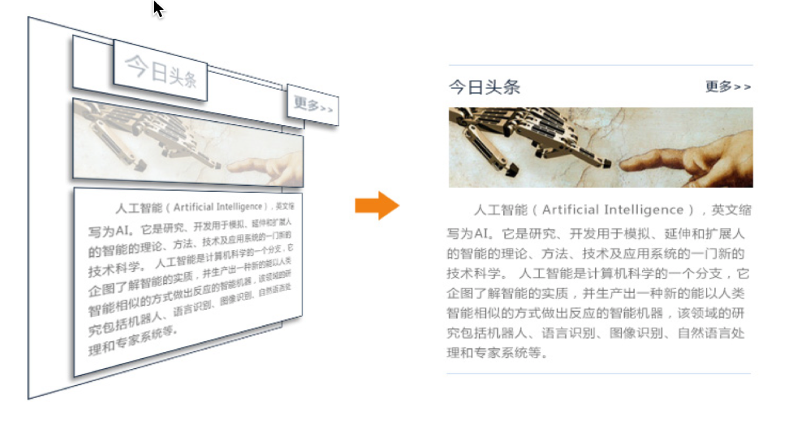
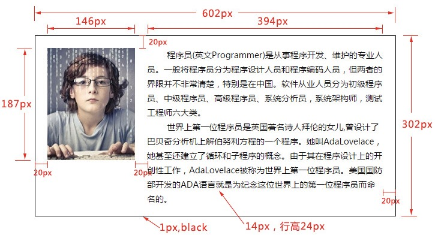
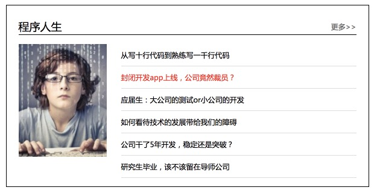
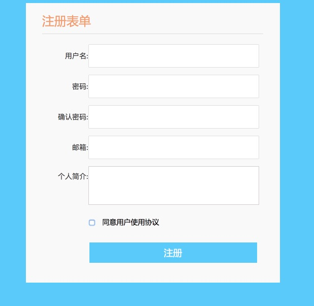
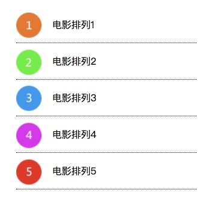

# 3、HTML之八个静态HTML案例

本章介绍介个静态HTML案例，以供读者实践前两章的内容。相关源代码在code文件夹中，由于源代码在主要位置已注释，因此不讲解。

## 今日头条案例

用div细分模块方便界面布局 样式设置及调整，实现如下图片要求的效果。



它的主要元素属性如下：


完整代码：case01_01today.html

```html
<!DOCTYPE html>
<html lang="zh-cn">

<head>
    <meta charset="UTF-8">
    <meta name="viewport" content="width=device-width, initial-scale=1.0">
    <meta http-equiv="X-UA-Compatible" content="ie=edge">
    <title>16_今日头条案例优化</title>

    <style>
        /* 整体大小 */
        .box{
            width: 285px;
            height: 310px;

            border-top: 1px solid #c8dcf2;
            border-bottom: 1px solid #c8dcf2;
            /* 设置margin的左右为auto时可以实现水平居中 */
            margin: 0px  auto;

        }

        .box h1{
            color: #172c45;
            font-size: 16px;
            font-family: "Microsoft Yahei";
            /* 设置文字是否加粗 加粗 bold normal */
            font-weight: normal;
            /* 浮动 只分左浮动 或右浮动 无论是块元素还是行内元素只要浮动之后都可以排在一行 */
            float: left;

        }

        .box a{
            color: #172c45;
            font-size: 12px;
            font-family: "Microsoft Yahei";
            /* 去掉下划线   underline  none */
            text-decoration: none;
            float: right;
            /* background-color: gold; */
            /* 设置行高  让文字垂直居中 */
            line-height: 40px;
        }
        /* 设置头部的高度 */
        .head{
            height: 40px;
        }

        .box p{
            color: #737373;
            font-size: 12px;
            font-family: "Microsoft Yahei";
            line-height: 20px;
        }
    </style>
</head>

<body>
    <!-- alt +shift + f 格式化 对齐 -->
    <!-- 整个今日头条的大框 -->
    <div class="box">
        <!-- 1.头部 -->
        <div class="head">
            <!-- 1.1 标题 -->
            <h1>今日头条</h1>
            <!-- 1.2 更多 -->
            <a href="#">更多&gt;&gt;</a>
        </div>

        <!-- 2.配图 -->
        

        <!-- 3.描述文字 -->
        <p>
                &nbsp;&nbsp;&nbsp;&nbsp;&nbsp;&nbsp;人工智能（Artificial Intelligence），英文缩写为AI。它是研究、开发用于模拟、延伸和扩展人的智能的理论、方法、技术及应用系统的一门新的技术科学。 人工智能是计算机科学的一个分支，它企图了解智能的实质，并生产出一种新的能以人类智能相似的方式做出反应的智能机器，该领域的研究包括机器人、语言识别、图像识别、自然语言处理和专家系统等.
        </p>
    </div>

</body>

</html>
```

## 文章配图布局案例

实现如下文章和配图。



源代码：

```html
<!DOCTYPE html>
<html lang="zh">

<head>
    <meta charset="UTF-8">
    <meta name="viewport" content="width=device-width, initial-scale=1.0">
    <meta http-equiv="X-UA-Compatible" content="ie=edge">
    <title>文章配图布局案例</title>

    <style>
        .box {
            width: 600px;
            height: 300px;
            border: 1px solid black;
        }
        
        img {
            margin: 20px;
            /* 浮动实现图片处于最左侧 */
            float: left;
        }
        
        p {
            font-size: 14px;
            line-height: 24px;
            margin-top: 20px;
        }
        
        .text {
            width: 394px;
            height: 300px;
            margin-right: 20px;
            /* 浮动使得文本块处于最右侧 */
            float: right;
        }
    </style>
</head>

<body>
    <div class="box">
        
        <div class="text">
            <p>
                &nbsp;&nbsp;&nbsp;&nbsp;&nbsp;&nbsp;程序员(英文Programmer)是从事程序开发、维护的专业人员。一般将程序员分为程序设计人员和程序编码人员，但两者的界限并不非常清楚，特别是在中国。软件从业人员分为初级程序员、中级程序员、高级程序员、系统分析员，系统架构师，测试工程师六大类。
                <br /> &nbsp;&nbsp;&nbsp;&nbsp;&nbsp;&nbsp;世界上第一位程序员是英国著名诗人拜伦的女儿,曾设计了巴贝奇分析机上解伯努利方程的一个程序。她叫AdaLovelace，她甚至还建立了循环和子程序的概念。由于其在程序设计上的开创性工作，AdaLovelace被称为世界上第一位程序员。美国国防部开发的ADA语言就是为纪念这位世界上的第一位程序员而命名的。
            </p>
        </div>
    </div>
</body>

</html>
```

## 类似QQ新闻标题列表案例

实现如下所示的新闻标题列表，点击更多可跳转至超链接，鼠标放置在新闻标题上显示红色。使用外链式CSS(上一章提到的reset代码片段，源代码见code文件夹中的css文件夹)重置样式，内置式CSS编制样式，无序列表编写新闻标题列表。



源代码：

```html
<!DOCTYPE html>
<html lang="zh-cn">

<head>
    <meta charset="UTF-8">
    <meta name="viewport" content="width=device-width, initial-scale=1.0">
    <meta http-equiv="X-UA-Compatible" content="ie=edge">
    <title>QQ新闻标题列表</title>
    <link rel="stylesheet" href="./css/reset.css">
    <style>
        .box {
            width: 600px;
            height: 300px;
            border: 1px solid black;
            margin: 20px auto;
            font-size: 0;

            /* padding: 20px; */
        }

        .box .head_info {
            height: 28px;
            border-bottom: 1px solid black;
            margin: 20px 20px 0px 20px;
        }

        .head_info h3 {
            font-size: 18px;
            font-family: 'Microsoft YaHei';

            display: inline;

            line-height: 30px;
        }

        .head_info a {
            text-decoration: none;
            font-family: 'Microsoft YaHei';
            font-size: 12px;
            color: #666666;
            float: right;
            line-height: 30px;
        }
        .text_info{
            width: 560px;
            margin: 15px auto 0;
        }

        .box ul {
            font-size: 12px;
            font-family: 'Microsoft YaHei';
            width: 390px;
            float: right;

            margin-left: 20px;
        }

        .box li {
            border-bottom: 1px solid #dddddd;
            height: 36px;
            /* 设置行高可使文字自动垂直居中 */
            line-height: 36px;
        }


        .box li:hover {
            color: red;
        }
    </style>
</head>

<body>
    <div class="box">
        <!-- 头部信息 -->
        <div class="head_info">
            <h3>程序人生</h3>
            <a href="#">更多&gt;&gt;</a>
        </div>
        <!-- 列表信息 -->
        <div class="text_info">
            
            <!-- 无序列表实现新闻标题列表 -->
            <ul>
                <li>从写十行代码到熟练写一千行代码</li>
                <li>封闭开发app上线，公司竟然裁员？</li>
                <li>应届生：大公司的测试or小公司的开发</li>
                <li>如何看待技术的发展带给我们的障碍</li>
                <li>公司干了5年开发，稳定还是突破？</li>
                <li>研究生毕业，该不该留在导师公司</li>
            </ul>
        </div>
    </div>
</body>

</html>
```

## 商品图片列表展示案例

实现一个商品图片列表展示，每个图片为一个链接，点击可实现超链接。


源代码：

```html
<!DOCTYPE html>
<html lang="zh-cn">
<head>
    <meta charset="UTF-8">
    <meta name="viewport" content="width=device-width, initial-scale=1.0">
    <meta http-equiv="X-UA-Compatible" content="ie=edge">
    <title>商品图片列表展示</title>
    <style>
        .box{
            width: 958px;
            height: 270px;
            border: 1px solid #d1d1d1;
            margin: 10px auto;
            /* 采用浮动实现图片列表，因此需要隐藏溢出的元素 */
            overflow: hidden;
        }
        .box .header{
            width: 918px;
            height: 50px;
            border-bottom: 1px solid #d1d1d1;
            margin: 0px auto;
        }
        .box .header div{
            font-size: 18px;
            font-family: 'Microsoft YaHei';
            color: #000;
            line-height: 50px;

            width: 100px;
            height: 50px;
            /* 红线设置 */
            border-bottom: 2px solid #fe0201;
            text-align: center;
        }
        .box .picture{
            list-style: none;
            width: 948px;
            height: 199px;
            /* 图片之间的间距设置 */
            margin: 20px 0 0 20px;
            /* ul标签的内边距清除 */
            padding: 0;
        }
        .picture li{
            width:160px;
            height:68px;
            /* 浮动实现图片列表分布布局 */
            float:left;
            /* 无序列表间距实现 */
            margin:0 29px 25px 0;
        }
    </style>
</head>
<body>
    <div class="box">
        <div class="header">
            <div>图片展示</div>
        </div>
        <ul class="picture">
            <li></li>
            <li></li>
            <li></li>
            <li></li>
            <li></li>
            <li></li>
            <li></li>
            <li></li>
            <li></li>
            <li></li>
        </ul>
    </div>
</body>
</html>
```

## 注册表单案例

实现下图的注册表单效果：




源代码：

```html
<!DOCTYPE html>
<html lang="zh-cn">

<head>
    <meta charset="UTF-8">
    <meta name="viewport" content="width=device-width, initial-scale=1.0">
    <meta http-equiv="X-UA-Compatible" content="ie=edge">
    <title>注册表单</title>
    <style>

        .clearfix:before{
            /* margin-top 塌陷修复 */
            content:"";
            display:table;
        }

        body{
            /* 网页背景色 */
            background-color: #00ccff;
        }

        .box{
            /* 注册表单总大小、背景色、左右居中 */
            width: 500px;
            height: 550px;
            background-color: #f9f9f9;
            margin: 10px auto;
        }
        .box h3{
            /* 注册表单四个字设置 */
            color: #ff9966;
            font-size: 24px;
            font-family: 'Microsoft YaHei';
            font-weight: normal;
            padding: 0px;
            line-height: 50px;

            width: 435px;
            margin: 10px auto 0px;
            border-bottom: 1px solid #dddddd;
        }

        .box form{
            width: 434px;
            margin: 0px auto;
            font-size: 0;
        }
        .box form p{
            width: 430px;
            height: 40px;
            padding: 0;
            margin: 20px auto 5px;
        }

        .box label{
            display: inline-block;
            width: 88px;
            /* background-color: #00cc00; */
            text-align: right;
            font-size: 14px;
            color: #333333;
            line-height: 40px;
        }

        .box .profile{
            height: 70px;
        }

        .box p .profile{
            width: 88px;
            height: 40px;
            text-align: right;
            font-size: 14px;
            line-height: 40px;
            float: left;
        }

        textarea {
            /* 个人简介输入框设置 */
            resize: none;
            width: 330px;
            height: 70px;
            border: 1px solid rgb(209, 206, 206);
        }

        .box input{
                 /* 输入框设置 */
            width: 330px;
            height: 40px;
        }

        .box .agree{
            /* 同意字体设置 */
            width:330px;
            height: 40px;
            font-size: 14px;
            font-family: 'Microsoft YaHei';
            line-height: 40px;
            margin-right: 15px;
        }
        .box .agree .agree{
            /* 同意按钮设置 */
            width: 10px;
            height: 34px;
            float: left;
        }

        .box .submit{
            /* 提交按钮和文字设置 */
            border: none;
            width: 330px;
            height: 40px;
            background-color: #00ccff;
            font-size: 18px;
            font-family: 'Microsoft YaHei';
            color: white;
            line-height: 36px;
            float: right;
            padding: 0;
            margin-right: 10px;
        }
    </style>
</head>

<body>
    <div class="box clearfix">
        <h3>注册表单</h3>
        <form class="clearfix" action="">
            <p>
                <label for="">用户名:</label>
                <input type="text" name="username">
            </p>
            <p>
                <label for="">密码:</label>
                <input type="password" name="pwd">
            </p>
            <p>
                <label for="">确认密码:</label>
                <input type="password" name="pwd_again">
            </p>
            <p>
                <label for="">邮箱:</label>
                <input type="email" name="email_address">
            </p>
            <p class="profile">
                <label class="profile" for="">个人简介:</label>
                <textarea name="profile"></textarea>
            </p>
            <p class="agree">
                    <input class="agree" type="checkbox" required="required">同意用户使用协议
            </p>
            <p>
                    <input class="submit" type="submit" value="注册">
                </p>
        </form>
    </div>

</body>

</html>
```

## 网站主页导航栏案例

采用列表标签实现网站主页导航栏(也可使用HTML5中的`<nav>`标签)：


源代码：

```html
<!DOCTYPE html>
<html lang="zh-cn">
<head>
    <meta charset="UTF-8">
    <meta name="viewport" content="width=device-width, initial-scale=1.0">
    <meta http-equiv="X-UA-Compatible" content="ie=edge">
    <title>网站主页导航栏</title>
    <style>
        .box{
            list-style: none;
            padding: 0;

            width: 960px;
            height: 40px;
            border: 1px solid #d1d1d1;
            margin: 50px auto;
            /* 采用行内块，需要将父级元素字体大小设置为0，以便消除块间间隙 */
            font-size: 0;

            text-align: center;
        }
        .box li{
            /* 行内块让所有列在同一行 */
            display: inline-block;
            font-size: 14px;
            font-family: 'Microsoft YaHei';
            color: #3d3d3d;
            line-height: 40px;
            /* 各块左右相隔20px */
            margin: 0px 10px;
        }
    </style>
</head>
<body>
    <ul class="box">
        <li>首&nbsp;页</li>
        <li>|</li>
        <li>网站建设</li>
        <li>|</li>
        <li>程序开发</li>
        <li>|</li>
        <li>网络营销</li>
        <li>|</li>
        <li>企业VI</li>
        <li>|</li>
        <li>案例展示</li>
        <li>|</li>
        <li>联系我们</li>
    </ul>
</body>
</html>
```

## 搜索条案例

实现和百度搜索条一样的效果，如下图：


源代码：

```html
<!DOCTYPE html>
<html lang="zh-cn">
<head>
    <meta charset="UTF-8">
    <meta name="viewport" content="width=device-width, initial-scale=1.0">
    <meta http-equiv="X-UA-Compatible" content="ie=edge">
    <title>搜索条</title>
    <style>
        .searchbar{
            /* 搜索条大小设置 边框设置 左右居中 */
            width: 600px;
            height: 40px;
            border: 1px solid #10ad10;
            margin: 50px auto 0px;
        }
        .input_text{
            width: 500px;
            height: 40px;
            font-size: 12px;
            font-family: 'Microsoft YaHei';
            /* 文本输入框有默认边框和内边距 */
            border: 0;
            padding: 0;
            text-indent: 1em;
            /* 取消外边框高亮 */
            outline: none;
        }
        .submit_bon{
            width: 100px;
            height: 40px;
            background-color: #10ad10;
            color: white;
            font-family: 'Microsoft YaHei';
            font-size: 18px;
            /* 默认边框和内边距 */
            border: 0;
            padding: 0;
            /* 右浮动时为了去掉行内元素之间默认间隙问题 */
            float: right;
            /* 取消点击输入框时边框高亮 */
            outline: none;
            /* 鼠标放上去后显示为小手 */
            cursor: pointer
        }
    </style>
</head>
<body>
    <form class="searchbar" action="">
        <!-- 占位提示文字：请输入要搜索的内容 -->
        <input type="text" name="search_content" placeholder="请输入要搜索的内容" class="input_text">
        <input type="submit" value="搜索" class="submit_bon">
    </form>
</body>
</html>
```

## 精灵图实现电影排行案例

精灵图也叫雪碧图，雪碧图被运用在众多使用了很多小图标的网站上。相对于把每张小图标以.png格式文件的形式引用到页面上，使用雪碧图只需要引用一张图片，对内存和带宽更加友好。 

使用雪碧图的优点有以下几点：

1. 将多张图片合并到一张图片中，可以减小图片的总大小
2. 将多张图片合并到一张图片后，只需一次网络请求就可以将所需的资源全部下载，减小建立连接的消耗，在移动端尤为明显

雪碧图的制作与使用方法：

1. 使用图像编辑软件如Photoshop将多张图放到同一个图层并导出或使用自动化构建工具自动拼接合并后的图片
2. 引用图片时，图片地址为合并后的图片地址，通过background-position调整背景图的位置，并通过容器的宽高共同作用，来选出所需的图片。

本案例实现如下电影排行效果：



源代码：

```html
<!DOCTYPE html>
<html lang="zh-cn">
<head>
    <meta charset="UTF-8">
    <meta name="viewport" content="width=device-width, initial-scale=1.0">
    <meta http-equiv="X-UA-Compatible" content="ie=edge">
    <title>雪碧图电影排行案例</title>

    <style>
        .list{
            list-style: none;
            margin: 0px;
            padding: 0px;

            width: 300px;
            margin: 50px auto 0px;


        }

        .list li{
            height: 60px;
            border-bottom: 1px dotted black;
            text-indent: 60px;
            /* 雪碧图作为背景图片，不平铺 */
            background-image: url("./images/sprite_bg.png");
            background-repeat: no-repeat;
            background-position-y: 10px;
        }


        .list .icon1{
            /* 通过移动y向雪碧图作为背景的位置 来实现不同列显示不同的背景图片 */
            background-position-y: -70px;
        }
        .list .icon2{
            background-position-y: -153px;
        }
        .list .icon3{
            background-position-y: -233px;
        }
        .list .icon4{
            background-position-y: -314px;
        }


        .list a{
            text-decoration: none;
            color: black;
            line-height: 60px;
        }

        .list a:hover{
            color: red;
        }
    </style>
</head>
<body>
    <ul class="list">
        <li><a href="#">电影排列1</a></li>
        <li class="icon1"><a href="#">电影排列2</a></li>
        <li class="icon2"><a href="#">电影排列3</a></li>
        <li class="icon3"><a href="#">电影排列4</a></li>
        <li class="icon4"><a href="#">电影排列5</a></li>
    </ul>
</body>
</html>
```

