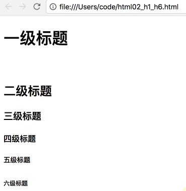
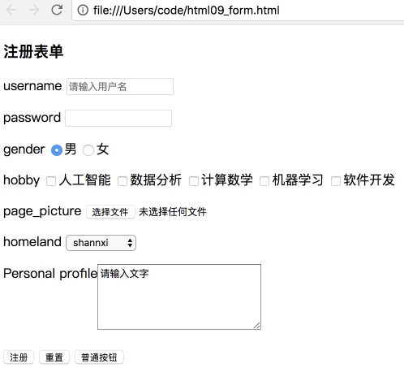
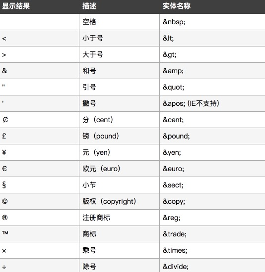

`HTML`即HyperText Markup Language——超文本标记语言，是标准通用标记语言下的一个应用。超文本的意思就是指页面内可以包含图片、链接，甚至音乐、程序等非文字元素。

网页文件本身是一种文本文件，通过在文本文件中添加标记符，可以告诉浏览器如何显示其中的内容；然后浏览器按照顺序阅读文件，根据标记解释和显示内容，实现特定的内容展示。所以说，网页的本质就是超级文本标记语言，通过结合使用其他web技术（脚本语言、网关接口、组件等），可以创造出丰富的、功能强大的网页。

超文本标记语言文档制作不是很复杂，但是功能很强大，支持不同数据格式的文件镶入。随着技术的发展，HTML也从1993年的第一版持续发展到2014年的HTML5 ，这当中伴随着web技术的巨大变迁，web技术也从1.0发展到了3.0 。目前web技术也在从web3.0中的知识有序共建向web4.0的知识分配发展，这种全民web共享知识创建财富的趋势促使普通人也需要了解HTML。在标记语言发展中，出现了各式各样的分类：`VML、UML、MML、CML、XHTML、XML`等。本文仅仅指最基础的网页`HTML5.0`。

# 1、HTML基础之HTML标签

## 什么是标签？

超文本标记语言之所以这么强大，主要在于编写时的标记和解释的标记，我们称之为标签。标签(tag)是HTML语言最基本的元素和组成部分，它使网页可以划分范围、内容区域、解释区域以及相应的引用。也就是说，==标签是一种符号，一种能够使网页内各种内容相互区分的符号、且使内容或数据更加有序的、特殊并约定俗称的符号==。

和一般的语言一样，一般我们都会以hello起步，如下面一段代码可以在浏览器上显示`hello html`，该段为`html`文件最基础的结构，涵盖了基础标签：
第2行`<!DOCTYPE html>`为文档类型声明标签；
第4行`<html></html>`为文档根标签；
第6行`<head></head>`标签内包含关于文档的信息；
第8-10行`<meta>` 元素内可提供有关页面的元信息（meta-information），比如针对搜索引擎和更新频度的描述和关键词等；
第12行`<title></title>`标签内定义文档的标题；
第15行`<body></body>`标签内定义文档的主体。其中包含文档的所有内容（比如文本、图像、颜色、图形等等）。

```HTML
<!-- 文档声明类型-->
<!DOCTYPE html>
<!-- html文档的根标签-->
<html lang="zh-cn">
<!-- 网页头部信息，用来做网页的基本配置 -->
<head>
    <!-- 网页字符编码 -->
    <meta charset="UTF-8">
    <meta name="viewport" content="width=device-width, initial-scale=1.0">
    <meta http-equiv="X-UA-Compatible" content="ie=edge">
    <!-- 网页在浏览器窗口中显示的标题 -->
    <title>HTML基本结构</title>
</head>
<!-- 此标签中写网页中显示的内容 -->
<body>
    hello html!
</body>

</html>
```

可以很清晰的看到，**除了个别标签外，几乎所有的标签均为成对出现，且由一对尖括号组成**，这个要牢记。由于标签众多，且目前学习资料及其丰富，本文仅粗略简单的介绍一些常用标签，具体的深入了解，笔者向大家推荐W3school的html参考手册和官方文档查询。

## HTML常用标签与分类

根据经常使用的功能，我们这里把常用的标签分为以下几类：

- 文章标签：h1~h6、p、br、span、bdo、pre、acronym、abbr、blockquote、q、ins等。
- 字体样式标签：i、b、strong、em、code、samp等。
- 列表标签:ul、ol、li、dl、dt、dd
- 超链接标签: a
- 多媒体标签：img、audio、video、map、area、object、param等
- 表格标签：table、td、tr、th、thead、tbody、tfoot、col、colgtoup、caption
- 表单标签：form、input、button、label、option、textarea、select、optgroup、fieldset、legend
- 布局标签：div
- 文档标签：html、head、body、title、meta、style、link、script、noscript、base等
- 特殊字符
- 其他标签

接下来我们介绍其中一些频繁使用的一些标签。

### 常见文档标签

| 标签名           | 描述                                  |
| ------------- | ----------------------------------- |
| style         | 定义文档中的样式。一般通过CSS来设置html元素样式         |
| link          | 定义两个连接文档之间的关系，如外链的css文件、js文件等       |
| script        | 定义一段脚本                              |
| noscript      | 用来定义在脚本未被执行时的替代内容（文本）。常用在浏览器不支持脚本时。 |
| base          | 规定页面中所有链接的基准 url                    |
| &lt;!--…—&gt; | 注释标签,用于在源文档中插入注释                    |

### h1-h6标题标签

h1-h6标签代表里面的元素默认样式相应的为一级标题到六级标题。此标签必须成对出现。`<h1>`定义最大的标题,`<h6>`定义最小的标题。由于 h 元素拥有确切的语义，因此应当慎重地选择恰当的标签层级来构建文档的结构，相反，我们应当使用层叠样式表CSS定义来达到漂亮的显示效果。

实例：

注：后面标签介绍一般仅仅为单个标签修改，所以除了一些案例，后续代码块默认不展示body标签外的内容以及结果展示。

```Html
<!DOCTYPE html>
<html lang="zh-cn">
<head>
    <meta charset="UTF-8">
    <meta name="viewport" content="width=device-width, initial-scale=1.0">
    <meta http-equiv="X-UA-Compatible" content="ie=edge">
    <title>02_标题标签</title>
</head>
<body>
    <h1>一级标题</h1>
    <h2>二级标题</h2>
    <h3>三级标题</h3>
    <h4>四级标题</h4>
    <h5>五级标题</h5>
    <h6>六级标题</h6>
</body>
</html>
```



### p段落标签与br换行标签

p标签用来定义段落，成对出现。

```html
<p>&nbsp;&nbsp;&nbsp;&nbsp;&nbsp;&nbsp;人工智能（Artificial Intelligence）
  <br />
  英文缩写为AI
</p>
```

### 几种字体样式标签

```html
    <i>斜体</i>
    <b>粗体</b>
    <strong>重要的文本</strong>
    <code>代码样式文本</code>
```

### 超链接标签a

定义超链接，它用于从一个页面连接到另一个页面。

```Html
<a href="http://www.baidu.com" target="_blank">跳转百度</a>
```

上面这行代码中href是指链接的目标URL，target为在何处打开目标URL（_blank指在浏览器新标签页打开）。其他标签a的属性如下：

| 属性       | 描述                                       |
| -------- | ---------------------------------------- |
| href     | 链接的目标 URL                                |
| hreflang | 规定目标 URL 的基准语言。仅在 href 属性存在时使用。          |
| media    | 规定目标 URL 的媒介类型。默认值：all。仅在 href 属性存在时使用。  |
| ping     | 由空格分隔的 URL 列表，当用户点击该链接时，这些 URL 会获得通知。仅在 href 属性存在时使用。 |
| rel      | 规定当前文档与目标 URL 之间的关系。仅在 href 属性存在时使用。     |
| target   | 在何处打开目标 URL。仅在 href 属性存在时使用。             |
| type     | 规定目标 URL 的 MIME 类型。仅在 href 属性存在时使用。      |

### 图像标签img

```html

```

上面这行代码是指打开路径在`./images/banner.jpg`的图片，当图片不能加载显示时，网页显示人工智能。img标签的主要属性有：

| 属性     | 值    | 描述              |
| ------ | ---- | --------------- |
| alt    |      | 定义有关图片的短的描述     |
| src    |      | 要显示图像的url       |
| height | px、% | 定义图像高度          |
| ismap  | url  | 把图像定义为服务器端的图像映射 |
| usemap | url  | 把图像定义为客户端的图像映射  |
| width  | px、% | 定义图像宽度          |
| vspace | px   | 定义图像顶部、底部的空白    |

### 列表标签

ul标签用来定义无序列表；ol标签用来定义有序列表；li标签定义列表项。

```Html
<ul>
   <li>Coffee</li>
   <li>Tea</li>
</ul>
<ol>
   <li>Coffee</li>
   <li>Tea</li>
</ol>

<ol>
   <li value="8">Coffee</li>
   <li>Tea</li>
</ol>
```

其中，ol标签的属性有：

| 属性  | 值                                                | 描述                                                  |
| ----- | ------------------------------------------------- | ----------------------------------------------------- |
| type  | A、  a、  I、  i、  1、  disc、  square、  circle | 规定列表序号的类型。不赞成使用。一般使用CSS替代实现。 |
| value | number_of_list_item                               | 不赞成使用。一般使用CSS替代实现。                     |

### 表格标签

如下代码实现了一个最常见的简历表格。

```html
<table border="1px">
        <tr>
            <td  class="header" colspan="5">基本情况</td>
        </tr>
        <tr>
            <td width="15%">姓 名</td>
            <td width="25%"></td>
            <td width="15%">性 别</td>
            <td width="25%"></td>
            <td width="20%" rowspan="5"></td>
        </tr>
        <tr>
            <td>民 族</td>
            <td></td>
            <td>出生日期</td>
            <td></td>

        </tr>
        <tr>
            <td>政治面貌</td>
            <td></td>
            <td>健康情况</td>
            <td></td>

        </tr>
        <tr>
            <td>籍 贯</td>
            <td></td>
            <td>学 历</td>
            <td></td>
 
        </tr>
        <tr>
            <td>电子信箱</td>
            <td></td>
            <td>联系电话</td>
            <td></td>

        </tr>
    </table>
```

其中，table标签定义表格，在它定义的内部，可以放置表格的标题、表格行、表格列、表格单元以及其他的表格；tr标签定义表格中的行；td标签定义表格中的一个单元格，它有两个属性：

| td属性    | 值      | 描述     |
| ------- | ------ | ------ |
| rowspan | number | 跨行的单元格 |
| colspan | number | 跨列的单元格 |

### 表单标签

如下一段代码实现一个常用的网站注册表单。

```html
    <h3>注册表单</h3>
    <!-- action 为要将数据提交到哪个url -->
    <!-- method 为发送数据时的请求方式 get post等 -->
    <form action="" method="get">
        <p>
            <label for="">username</label>
            <!-- name 为在提交数据时的字段/键 -->
            <!-- placeholder 占位提示 -->
            <input type="text" name="username" placeholder="请输入用户名">
        </p>
        <p>
            <label for="">password</label>
            <input type="password" name="password">
        </p>
        <p>
            <label for="">gender</label>
            <!-- 单选 -->
            <!-- cheacked 为默认选择选项 -->
            <!-- value为要提交的值 -->
            <input type="radio" name='gender' checked value="0">男
            <input type="radio" name='gender' value="1">女

        </p>
        <p>
            <label for="">hobby</label>
            <!-- 多选 -->
            <input type="checkbox">人工智能
            <input type="checkbox">数据分析
            <input type="checkbox">计算数学
            <input type="checkbox">机器学习
            <input type="checkbox">软件开发
        </p>
        <p>
            <label for="">page_picture</label>
            <!-- 文件 -->
            <input type="file">
        </p>
        <p>
            <label for="">homeland</label>
            <!-- 文件 -->
            <select>
                <option value="">shannxi</option>
                <option value="">Beijing</option>
                <option value="">Shanghai</option>
                <option value="">guangzhou</option>
            </select>
        </p>
        <p>
            <label style="float:left" for="">Personal&nbsp;profile</label>
            <!-- 文本区域 -->
            <textarea cols="30" rows="5">请输入文字</textarea>
        </p>
        <p>
            <input type="submit" value="提 交">
            <input type="reset" value="重置">
            <input type="button" value="普通按钮">
        </p>
    </form>
```



在这段代码中我们使用了form标签、label标签、input标签、select标签、option标签和textarea标签。这些标签含义如下表所示：

| 标签     | 描述                                                         |
| -------- | ------------------------------------------------------------ |
| form     | 创建供用户输入的表单。 表单可包含文本域，复选框，单选按钮等等。表单用于向指定的 URL 传递用户数据。 |
| label    | 定义控件的标注。 如果在 label 元素内点击文本，就会触发此控件。就是说，当用户选择该标签时，浏览器就会自动将焦点转到和标签相关的表单控件上。 |
| input    | 定义输入字段，用户可在其中输入数据。最常用它的type属性、name属性。 |
| select   | 创建下拉列表                                                 |
| option   | 定义下拉列表中的一个选项                                     |
| textarea | 定义一个文本区域 (text-area) （一个多行的文本输入区域）。用户可在此文本区域中写文本。在一个文本区中，您可输入无限数量的文本。文本区中的默认字体是等宽字体 (fixed pitch)。 |

form标签的常用属性有：

| form属性         | 描述                                   |
| -------------- | ------------------------------------ |
| action         | 定义一个 URL。当点击提交按钮时，向这个 URL 发送数据。      |
| data           | 供自动插入数据。                             |
| method         | 用于向 action URL 发送数据的 HTTP 方法。默认是 GET |
| target         | 在何处打开目标 URL。                         |
| replace        | 定义表单提交时所做的事情。                        |
| accept         | 处理该表单的服务器可正确处理的内容类型列表（用逗号分隔）         |
| accept-charset | 表单数据的可能的字符集列表（逗号分隔）。默认值是 "unknown"   |
| enctype        | 用于对表单内容进行编码的 MIME 类型                 |

<font color=blue>提示</font>: method最常见的两种方式为GET和POST，它们的区别如下：

|          | GET                                      | POST                                     |
| -------- | ---------------------------------------- | ---------------------------------------- |
| 后退按钮/刷新  | 无害                                       | 数据会被重新提交（浏览器应该告知用户数据会被重新提交）。             |
| 书签       | 可收藏为书签                                   | 不可收藏为书签                                  |
| 缓存       | 能被缓存                                     | 不能缓存                                     |
| 编码类型     | application/x-www-form-urlencoded        | application/x-www-form-urlencoded 或 multipart/form-data。为二进制数据使用多重编码。 |
| 历史       | 参数保留在浏览器历史中。                             | 参数不会保存在浏览器历史中。                           |
| 对数据长度的限制 | 是的。当发送数据时，GET 方法向 URL 添加数据；URL 的长度是受限制的（URL 的最大长度是 2048 个字符）。 | 无限制。                                     |
| 对数据类型的限制 | 只允许 ASCII 字符。                            | 没有限制。也允许二进制数据。                           |
| 安全性      | 与 POST 相比，GET 的安全性较差，因为所发送的数据是 URL 的一部分。在发送密码或其他敏感信息时绝不要使用 GET ！ | POST 比 GET 更安全，因为参数不会被保存在浏览器历史或 web 服务器日志中。 |
| 可见性      | 数据在 URL 中对所有人都是可见的。                      | 数据不会显示在 URL 中。                           |

label标签属性：

| label属性 | 值                   | 描述                             |
| ------- | ------------------- | ------------------------------ |
| for     | id_of_another_field | 定义 label 针对哪个表单元素。设置为表单元素的 id。 |

input标签常用属性有：

| input标签属性 | 值                                                           | 描述                                                         |
| ------------- | ------------------------------------------------------------ | ------------------------------------------------------------ |
| type          | button  checkbox  date  datetime  datetime-local  email  file  hidden  image  month  number  password  radio  range  reset  submit  text  time  url  week | 指示 input 元素的类型。默认值是 "text"                       |
| name          | field_name                                                   | 为 input 元素定义唯一的名称。一般用于字段识别                |
| autocomplete  |                                                              | 自动补全                                                     |
| checked       | 布尔值                                                       | 指示此 input 元素首次加载时应当被选中。注释：请与 type="checkbox" 及 type="radio" 配合使用。 |
| pattern       |                                                              | 正则表达式                                                   |
| required      | 布尔值                                                       | 定义输入字段的值是否是必需的。                               |
| value         |                                                              | 对于按钮、重置按钮和确认按钮：定义按钮上的文本。<br />对于图像按钮：定义传递向某个脚本的此域的符号结果。<br />对于复选框和单选按钮：定义 input 元素被点击时的结果。<br />对于隐藏域、密码域以及文本域：定义元素的默认值。<br />注：不能与 type="file" 一同使用。<br />注：与 type="checkbox" 和 type="radio" 一同使用时，此元素是必需的。 |
| maxlength     | number                                                       | 定义文本域中所允许的字符最大数目                             |
| placeholder   |                                                              | 定义输入框预显示的内容                                       |
| autofocus     | 布尔值                                                       | 当页面加载时，使输入字段获得焦点。                           |

select标签属性：

| select标签属性 | 值           | 描述                             |
| ---------- | ----------- | ------------------------------ |
| name       | unique_name | 定义下拉列表的唯一标识符                   |
| multiple   | 布尔值         | 多选选项， 当该属性为 true 时，规定可一次选定多个项目 |
| autofocus  | 布尔值         | 在页面加载时使这个 select 字段获得焦点        |
| data       | url         | 供自动插入数据                        |
| disabled   | 布尔值         | 当该属性为 true 时，会禁用该菜单            |
| form       | 布尔值         | 定义 select 字段所属的一个或多个表单         |

option标签属性：

| option标签属性 | 值        | 描述                             |
| ---------- | -------- | ------------------------------ |
| value      | text     | 定义送往服务器的选项值                    |
| selected   | selected | 规定选项（在首次显示在列表中时）表现为选中状态。       |
| disabled   | disabled | 规定此选项应在首次加载时被禁用                |
| label      | text     | 定义当使用 &lt;optgroup&gt; 时所使用的标注 |

textarea标签常见属性：

| textarea标签属性 | 值      | 描述                        |
| ------------ | ------ | ------------------------- |
| rows         | number | 规定了文本区内可见的行数              |
| cols         | number | 规定了文本区内可见的列数              |
| name         |        | 为此文本区规定的一个名称              |
| form         |        | 定义该 textarea 所属的一个或多个表单。  |
| autofocus    | 布尔值    | 在页面加载时，使这个 textarea 获得焦点。 |

### div标签与span标签

div标签为块标签，span标签为行内块标签。

### 特殊字符



## HTML标签常见全局属性

一般我们通过标签来标记文本，通过CSS3来设置样式。不管采用何种方式来设置样式，均需要在设置前选中一些标签才能对其操作。所以，html5.0提供了标签的全局属性，基本如下表：

| 全局属性名           | 描述                         |
| --------------- | -------------------------- |
| class           | 规定元素的一个或多个类名（引用样式表中的类）     |
| id              | 规定元素的唯一 id                 |
| style           | 规定元素的行内 CSS 样式             |
| draggable       | 规定元素是否可拖动                  |
| dropzone        | 规定在拖动被拖动数据时是否进行复制、移动或链接    |
| dir             | 规定元素中内容的文本方向               |
| contextmenu     | 规定元素的上下文菜单。上下文菜单在用户点击元素时显示 |
| accesskey       | 规定激活元素的快捷键                 |
| hidden          | 规定元素仍未或不再相关                |
| lang            | 规定元素内容的语言                  |
| tabindex        | 规定元素的tab键次序                |
| title           | 规定有关元素的额外信息                |
| translate       | 规定是否应该翻译元素内容               |
| spellcheck      | 规定是否对元素进行拼写和语法检查           |
| contenteditable | 规定元素内容是否可编辑                |
| data-*          | 用于存储页面或应用程序的私有定制数据         |

